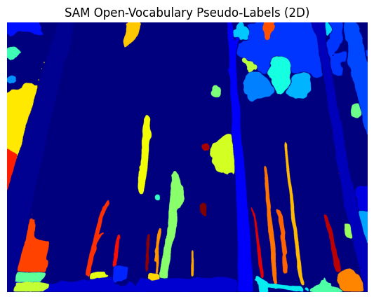
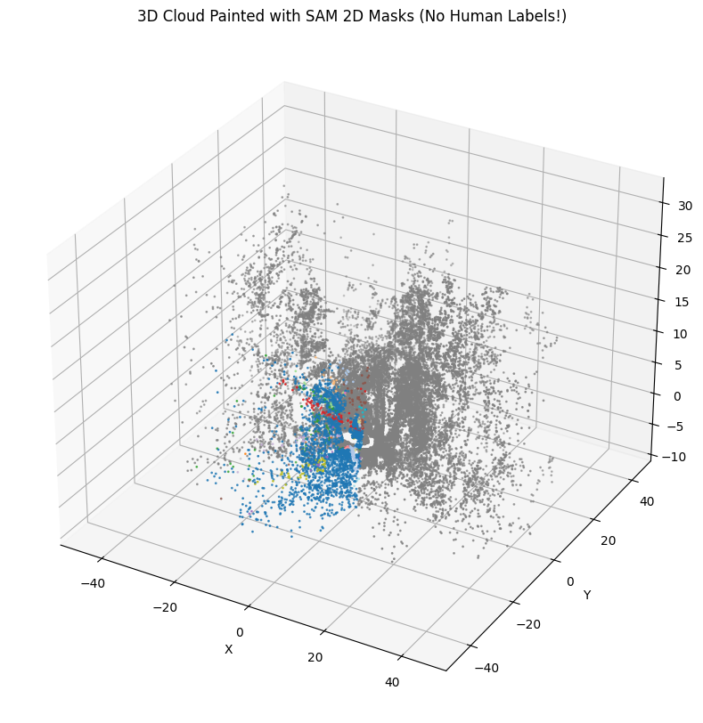

## Distilling 2D Foundation Model Features into 3D Point Clouds

This repository is a Proof of Concept(PoC) Python pipeline demonstrating how open-vocabulary 2D vision-language models (VLM) features can be geometrically projected into 3D LiDAR point clouds. We can leverage calibrated camera-LiDAR data from the CSIRO WildScenes dataset, this pipeline manufacture 3D point cloud labels without requiring manual human 3D annotation.

### Pipeline Overview
1. **Calibration & Pose Loading**: Parse camera intrinsics (K) and extrinsics `T_cam_lidar` from a YAML file.
2. **3D-to-2D Projection**: Transform 3D LiDAR points into the camera frame using quaternion rotations and pinhole camera projection.
3. **Z-Buffer Visibility Check**: Implement a depth buffer to ensure only the front-most 3D points are assigned 2D labels, correctly handling occlusions.
4. **2D Inference (SAM)**: Run Meta's Segment Anything Model (SAM) on the RGB image to generate class-agnostic 2D masks.
5. **Feature Distillation**: Map the 2D SAM masks back to the visible 3D points, painting the 3D geometry with 2D foundation model knowledge.

## Results


*2D Open-Vocabulary Pseudo-Labels generated by SAM.*


*3D LiDAR point cloud painted with distilled SAM masks. Grey points represent the 360° scan outside the camera's field of view.*

## Setup and usage
1. Clone this repository
2. Install dependencies: `pip install -r requirements.txt`
3. Download SAM Checkpoint:
4. 
```bash
wget https://dl.fbaipublicfiles.com/segment_anything/sam_vit_h_4b8939.pth
```

4. Download data: Obtain S3 aws credentials from [CSIRO WildScenes Dataset](https://data.csiro.au/collection/csiro:61541) and run the download script:

```bash
export AWS_ACCESS_KEY_ID="YOUR_KEY"
export AWS_SECRET_ACCESS_KEY="YOUR_SECRET"
bash download_data.sh
```
5. Run the pipeline:

```bash
python run_vlm_distillation.py
```


